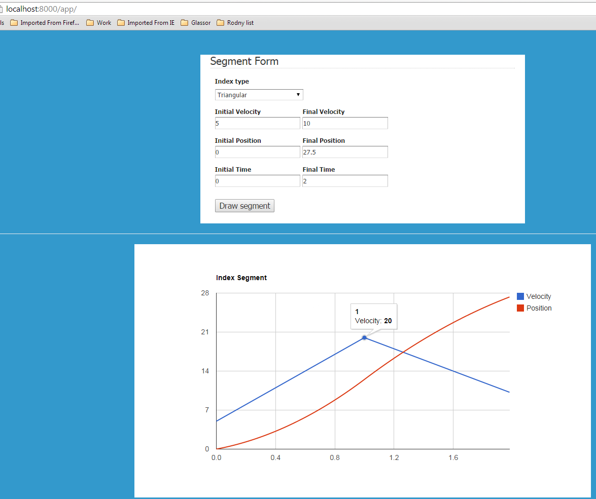

# Testing indexed segment functionality

## Overview

Demonstrates how different types of index segments can be calculated

Currently supports
* triangular segment (no jerk)
* trapezoidal segment (no jerk)

